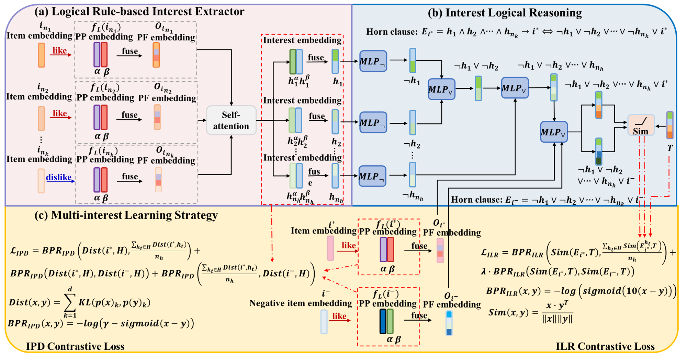

# Denoising Multi-Interest-Aware Logical Reasoning for Long-Sequence Recommendation
## Abstract
> Logical reasoning-based recommendation methods employ logical rules to mitigate the adverse effects of noise items in short interaction sequences on recommendation accuracy. However, there are two problems with existing methods: 1) As the length of the interaction sequence increases, introducing more noise items exacerbates the negative impact on logical reasoning, thereby reducing the accuracy of these methods. 2) They are often dominated by the user's single primary interest, which prevents simultaneous consideration of users' multiple-aspect interests in long sequences. To address these issues, we propose a novel dEnoising Multi-Interest-aware Logical rEasoning (EMILE) method for long-sequence recommendation. Specifically, we design a logical rule-based interest extractor that enhances the importance of preferred items in constructing user interests while minimizing the negative impact of disliked items. This extractor effectively mitigates the adverse effects of noise items in long interaction sequences. Furthermore, we propose a novel multi-interest learning strategy that optimizes two new objective functions—interest probability distribution contrastive loss and interest logical reasoning contrastive loss—to ensure the model simultaneously considers multiple-aspect interests. These two objective functions require that the target item is more closely aligned with multiple interests than the single primary interest, both in the probability distribution space and during logical reasoning. Experimental results on four public datasets demonstrate that our method significantly outperforms all compared baselines regarding recommendation accuracy.

<center>

</center>

## Running the Experiments

### 1. Environment

+ Python 3.7.3
+ PyTorch 1.12.1+cu113
+ scikit-learn 0.23.1
+ scipy 1.10.1
+ RTX 3090
+ Memory 128G

You can also install dependencies by

```bash
pip install -r requirements.txt
```

### 2. Dataset

| Dataset  | ML-1M   | MoTV    | Electronics | Books     |
|----------|---------|---------|-------------|-----------|
| #User    | 1,594   | 1,234   | 142,938     | 64,919    |
| #Item    | 2,054   | 20,773  | 47,402      | 25,694    |
| #Inter   | 248,220 | 264,282 | 2,508,516   | 3,420,055 |
| #MedLen  | 91.0    | 148.5   | 14.0        | 36.0      |
| Sparsity | 92.42%  | 98.97%  | 99.96%      | 99.79%    |

Four datasets contain user ID, item ID, and ratings. The MoTV, Books, and Electronics datasets can be obtained from [Amazon Review Data (2018)](https://nijianmo.github.io/amazon/index.html). We use the ``5-core'' version of these three datasets, in which all users and items have at least five interactions. First, we calculate the median sequence length of the interaction sequences for each dataset \footnote[2]{We calculate the dataset's sequence length using the median instead of the mean to avoid being affected by the maximum or minimum values of the sequence lengths.} and classify them based on the median sequence length. Specifically, the [ML-1M Dataset](https://grouplens.org/datasets/movielens/) and MoTV datasets (with \#MedLen $\geq$ 50)  are categorized as long-sequence data, while the Books and Electronics datasets (with \#MedLen $<$ 50) are categorized as short-sequence data. The sequence length in these four datasets indicates the number of items users interacted with over a recent period. 

## Train
* ML-1M (#Seq = 10)
```bash
> cd ./src/
> # ML_num = [3,5,7,9,11], max_his = [10,50,100]
> python MI_no_rule_main_length.py --rank 1 --model_name NCR --optimizer GD --lr 0.001 --dataset ML-1M --ML_num 5 --ML_model 'SA_beta_fuse'  --metric ndcg@5,ndcg@10,hit@5,hit@10 --max_his 10 --test_neg_n 100
```
* ML-1M (#Seq = 100)
```bash
> cd ./src/
> # ML_num = [3,5,7,9,11], max_his = [10,50,100]
> python MI_no_rule_main_length.py --rank 1 --model_name NCR --optimizer GD --lr 0.001 --dataset ML-1M --ML_num 3 --ML_model 'SA_beta_fuse'  --metric ndcg@5,ndcg@10,hit@5,hit@10 --max_his 100 --test_neg_n 100
```

## Results

|Method|||||ML1M-10||ML1M-100||
|:-:|:-:|:-:|:-:|:-:|:-:|:-:|:-:|:-:|
|Method|Propositional Logic|Self-attention Mechanism|ILR Loss|IPD Loss|NDCG@10|Time|NDCG@10|Time|
|NCR (Baseline)|ItLR|X|X|X|0.353|44.98s|0.207|124.46s|
|||||||||
|Our Variant 1|IALR|O|X|O|0.385|54.54s|0.246|57.67s|
|Our Variant 2|IALR|O|O|X|0.664|51.44s|0.523|60.34s|
|Ours|IALR|O|O|O|0.739|68.98s|0.532|86.64s|

We evaluated the efficiency and complexity of our method on two datasets with varying sequence lengths, using NCR as a baseline. The experimental results are shown in the following table, where "O" means "used," while "X" means "not used." ItLR stands for Item-based Logical Reasoning, while IALR stands for Interest Aware Logical Reasoning. ML1M-10 and ML1M-100 represent datasets ML-1M with sequence lengths of 10 and 100, respectively. We have the following observations:
- As sequence length increases (ML1M-10 to ML1M-100), NCR efficiency drops sharply (44s to 124s), while our MILR based on interest-aware logical reasoning remains stable (69s to 87s), highlighting its advantage in long-sequence scenarios.
- In the short sequence (ML1M-10), our Variant 1 reduced efficiency by 21% but improved accuracy by 9% compared to NCR. Our methods rely on fewer interests for long sequences, while NCR uses the entire item sequence, making our methods more efficient; for example, our Variant 2 only uses 52% of NCR time to improve NCR accuracy by 153% in the ML1M-100.
- Our method and two variants are significantly superior to NCR regarding efficiency and recommendation accuracy for long sequences.

See the full results in our paper.

